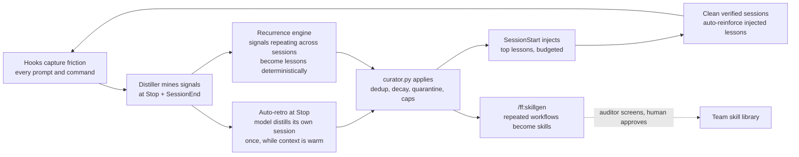

# Firefly Workspace

**A self-improving Claude Code plugin for airgapped engineering teams.**

Firefly Workspace turns Claude Code into a disciplined engineering partner for
SRE, QA, DEV, and Research teams running offline models in airgapped
environments. It encodes how senior engineers actually work - plan, verify,
debug systematically, never trust unproven claims - and it **learns from every
session**: friction becomes lessons, lessons shape future sessions, repeated
workflows become skills.

The operating principle: **the human is the architect, lawmaker, and
orchestrator. The AI implements, verifies, researches, and proposes.**

## Why this exists

Teams on weaker offline models complain the model "isn't good enough". Usually
the model is fine - the *harness* is missing. A weaker model with mechanical
discipline (plans before code, verification gates, root-cause debugging,
clean-context reviews, curated memory) reliably beats a stronger model driven
by ad-hoc prompts. This plugin is that harness.

## What it does

| Layer | What you get |
|---|---|
| **Workflows** (15 commands) | `/ff:plan`, `/ff:implement`, `/ff:review`, `/ff:debug`, `/ff:research`, `/ff:parallel`, `/ff:retro`, `/ff:commit`, `/ff:handoff`, `/ff:lessons`, `/ff:skillgen`, `/ff:init`, `/ff:onboard`, `/ff:config`, `/ff:env` |
| **Specialists** (7 agents) | planner, scout, implementer, evaluator, researcher, reflector, auditor - each with bounded tools and a fresh context |
| **Knowledge** (25 skills) | engineering discipline (TDD, systematic debugging, verification, planning) + SRE/QA/DEV/Research persona workflows + self-improvement protocols |
| **Guardrails** (8 hooks) | destructive commands denied, production contexts read-only, verification stop-gate, error-streak detection, prompt coaching, compaction handoff - all Python stdlib, all fail-open |
| **Memory** (`.firefly/`) | a curated lesson playbook with helpful/harmful counters, decay, quarantine, and human governance - injected into every session |
| **Source of truth** (`FIREFLY-ENV.md`) | your org's environment spec - exact GitLab/registry/cluster/docs facts pinned into every session so agents never invent endpoints |

## The self-improvement loop (fully automatic)

Every prompt, every command, every session feeds the loop - **no commands
required**:



Three automatic learning paths, layered:

1. **Auto-retro at Stop** - when a session generated >= 2 learnable signals,
   the Stop hook asks the model (once) to distill them into <= 3 playbook
   delta-ops before finishing. The session that hit the friction writes the
   lesson, while its context is still warm.
2. **Recurrence auto-lessons** - the same error/workflow/correction pattern
   appearing across >= 2 sessions becomes a quarantined lesson from a vetted
   template. No LLM involved at all.
3. **Implicit feedback** - sessions that end verified and correction-free
   give +1 helpful to every lesson that was injected. Two clean sessions
   activate a trial lesson. Usage IS the feedback.

### Team learning (every member improves the plugin for everyone)

Opt in by creating a shared directory: `mkdir .firefly-team` in the repo
(commit it - it merges cleanly because each member appends only to their
own `lessons/<author>.jsonl` file), or point `$FIREFLY_TEAM_DIR` at a shared
filesystem path (NFS/SMB). Then:

- **Confirmed sharing.** At the end of a session that produced fresh
  learnings, Firefly stops once and has Claude ask YOU: *"save these lessons
  to the team store so they improve Firefly for everyone?"* Say **yes** and
  they ship, attributed to you. Say **no and what should have happened
  instead** - your correction is filed as the lesson (the strongest learning
  signal there is). Nothing is shared without a human's yes.
- **Proven sharing.** Lessons that earn `helpful >= 2` with zero harm in
  your local playbook auto-share silently - they already passed the bar.
- **Consumption.** Everyone's SessionStart injects the top teammate lessons
  (deduped against their own playbook, author-attributed, vote-ranked), and
  their clean verified sessions vote those lessons up for the whole team.
- Review the store anytime: `/ff:lessons team`. Config under `team.*`
  (`confirm_save`, `max_inject`, `share_threshold`, `author`, `dir`).

Everything automated is **deterministic where it matters** (a Python script
applies all memory updates - the LLM only proposes). Everything durable is
**human-governed** (`/ff:lessons` is the law book; auto-lessons start
quarantined until they prove themselves). `/ff:retro` remains as the manual
deep pass over the full backlog. Zero maintenance effort.

## Install

### Standard

```text
/plugin marketplace add eldarush/firefly-workspace
/plugin install ff@firefly-workspace
```

### Airgapped (mirror via your internal Git)

```bash
# on the connected side: mirror this repo, then transfer per your process
git clone --mirror https://github.com/eldarush/firefly-workspace
# inside the airgap:
git clone <internal-git>/firefly-workspace /opt/claude/firefly-workspace
```

```text
/plugin marketplace add /opt/claude/firefly-workspace
/plugin install ff@firefly-workspace
```

Set `CLAUDE_CODE_PLUGIN_KEEP_MARKETPLACE_ON_FAILURE=1` in the airgap so an
unreachable origin never wipes the plugin cache. Full guide, team-wide rollout
via managed settings, and release checklist: [docs/INSTALL-airgapped.md](docs/INSTALL-airgapped.md).

**Requirements**: Claude Code >= 1.0 with plugin support; `python3` on PATH
(3.8+, stdlib only - on Windows ensure `python3` resolves). No network access
needed at runtime, ever.

### First run in a project

```text
/ff:init        # config, verifier detection, CLAUDE.md contract, protected contexts
/ff:env         # (recommended) create your environment spec - the source of truth
/ff:onboard     # interactive tour for new team members
```

### Your environment as the source of truth

Drop a `FIREFLY-ENV.md` at the repo root (template: `/ff:env`, or set
`$FIREFLY_ENV_SPEC` to share one org-wide file). Its `FF:ALWAYS` block - your
GitLab URL, registries, cluster contexts, docs endpoints - is pinned into
**every session**, and the rest is indexed by section so agents read exact
facts instead of inventing them. Everything works without the spec; with it,
agents stop guessing. Facts are injected as evidence, never as instructions.

## Daily loop

```text
/ff:plan add retry logic to the flink submitter     # interview -> approved plan
/ff:implement                                       # step-by-step, verification-gated
/ff:review                                          # independent clean-context review
/ff:commit                                          # disciplined commit
```

Learning happens by itself: friction captured every prompt, lessons distilled
at session close, reinforced by clean sessions. `/ff:retro` is the optional
deep pass when the backlog grows.

Plus: `/ff:debug` (hypothesis-driven root-causing), `/ff:research` (offline
docs deep-dive via Kiwix/WikiAll), `/ff:parallel` (best-of-N bake-offs),
`/ff:handoff` (context reset without losing state).

## Safety model

- **Destroy class** (`kubectl delete`, `helm uninstall`, `terraform destroy`,
  `rm -rf`, force-push, `curl | sh`, ...) - **denied**. The user runs these
  themselves, or tunes `.firefly/config.json`.
- **Mutate class** (`kubectl apply`, `helm upgrade`, `argocd sync`,
  `kargo promote`, `git push`, ...) targeting **protected contexts/namespaces**
  (default `*prod*`) - **denied**; elsewhere Claude Code's normal permission
  flow applies. Read-only diagnosis is always open.
- Every guard decision and playbook mutation is appended to
  `.firefly/audit.log`; every screened command (including allows) lands in
  `.firefly/events.jsonl` (`guard_check`).
- **Dry-run check**: test any command against policy without executing it -
  `python3 $CLAUDE_PLUGIN_ROOT/scripts/pre_tool_guard.py --check "<cmd>"`.
- **Verifier auto-registration**: custom check commands (`py run_ci.py`,
  `./selfcheck.sh`, `--verify` flags, ...) are recognized heuristically and
  pinned into `.firefly/config.json` `verify.commands` on first run, so the
  stop-gate and learning loop track your project's real verifier with zero
  setup.
- Hooks **fail open**: a hook crash can never take down your session.
- Risk-class vocabulary (R0 read-only ... R4 destructive) used across skills
  and agents. Details: [docs/SAFETY.md](docs/SAFETY.md).

## Repository layout

```
.claude-plugin/      plugin.json + marketplace.json (this repo IS a marketplace)
commands/            14 workflow commands  -> /ff:*
agents/              7 specialist subagents
skills/              25 skills (discipline, self-improvement, personas)
hooks/hooks.json     8 lifecycle hooks
scripts/             Python stdlib hook engine (lib, curator, distiller, 8 entry points)
assets/              config schema/example, CLAUDE.md contract snippet, doc templates
evals/               prompt-injection regression corpus
docs/                architecture, safety, self-improvement, personas, airgap install, adoption
tests/run_tests.py   offline test harness (58+ checks, no dependencies)
```

## Validate

```bash
python3 tests/run_tests.py     # full harness: hooks, curator, guard, structure
claude plugin validate .       # manifest check (when claude CLI is available)
```

## Docs

- [Architecture](docs/ARCHITECTURE.md) - components, data flow, design decisions
- [Self-improvement](docs/SELF-IMPROVEMENT.md) - the lesson lifecycle in depth
- [Safety](docs/SAFETY.md) - guard policy, risk classes, audit, config
- [Personas](docs/PERSONAS.md) - SRE / QA / DEV / Research usage patterns
- [Airgapped install](docs/INSTALL-airgapped.md) - mirroring, managed settings, release checklist
- [Adoption playbook](docs/ADOPTION.md) - rolling it out to a skeptical team, ROI metrics

## Design commitments

- **Weak-model-first**: every workflow assumes the model needs structure, not
  trust. Single-model friendly (`model: inherit` everywhere).
- **Offline-first**: Python stdlib only, no network calls, no vector DBs, no
  external services.
- **Human sovereignty**: nothing durable changes without a human gate; the
  guard never auto-approves what the user didn't already allow.
- **Anti-bloat**: no MCP configs, no statuslines, no themes. Every token the
  plugin injects must earn its place.

## License

MIT - see [LICENSE](LICENSE).
