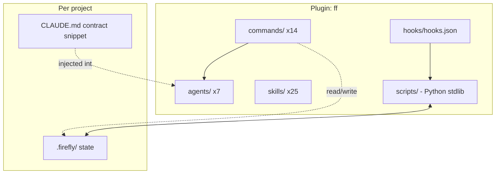

# Architecture

## Component map



## Layers

| Layer | Files | Job |
|---|---|---|
| Contract | `assets/CLAUDE.snippet.md` (via `/ff:init`) + SessionStart injection | pins roles (human=architect), verification rules, safety stance; CLAUDE.md reaches subagents too |
| Workflows | `commands/*.md` | the verbs: plan, implement, review, debug, research, parallel, retro... All `disable-model-invocation: true` - users invoke, the model cannot self-trigger them |
| Specialists | `agents/*.md` | fresh-context roles with bounded tools (read-only ones get `disallowedTools`); all `model: inherit` |
| Knowledge | `skills/*/SKILL.md` | discipline + persona know-how the model pulls in when relevant |
| Reflexes | `hooks/hooks.json` -> `scripts/*.py` | deterministic capture, guard, gates, injection - no LLM in the loop |
| Memory | `.firefly/` | config, events, candidates, proposals, playbook, audit, handoff |

## Hook wiring

| Event | Script | Effect |
|---|---|---|
| SessionStart (startup/resume/clear/compact) | `session_start.py` | housekeeping, apply proposals, inject contract + top lessons + handoff (<= 1600 tok) |
| UserPromptSubmit | `prompt_submit.py` | turn count, correction detection + nudge, task-frame injection (rate-limited 1/8 turns), apply proposals |
| PreToolUse (Bash) | `pre_tool_guard.py` | destroy -> deny; mutate-in-protected -> deny; audit |
| PostToolUse (*) | `tool_event.py` | flight recorder: edits, verify runs, error streaks (nudge at 2), command repetition |
| SubagentStop | `tool_event.py` | event log |
| Stop | `stop_gate.py` | block premature "done" when edits are unverified (max 2/session, honors `stop_hook_active`) |
| PreCompact (manual/auto) | `precompact.py` | write `.firefly/handoff.md` snapshot |
| SessionEnd | `session_end.py` | run the distiller -> candidates |

All scripts: Python 3.8+ stdlib, LF endings, fail-open (`except: exit 0`),
budgeted output. GA-era hook events only - no version-fragile features.

## Key design decisions

1. **Plugin name `ff`** - commands are typed many times a day; `/ff:plan`
   beats `/firefly-workspace:plan`. Display name carries the branding.
2. **Commands vs skills split** - workflows live in `commands/` (explicit user
   verbs, `disable-model-invocation`), knowledge in `skills/` (model-matched).
   Both surfaces stay compatible with older Claude Code versions.
3. **Deterministic curator** - the single most important choice. ACE-style
   delta ops + mechanical application means a weak model can propose but never
   corrupt. No LLM rewrites of accumulated memory, ever.
4. **`model: inherit` everywhere** - single-backend friendly; subagents are
   for *context isolation and role discipline*, not model routing.
5. **Fail-open hooks** - a Python crash must never cost a session. Safety
   comes from layered defenses, not from a brittle single gate.
6. **Per-project `.firefly/`, self-gitignored** - state follows the repo,
   never pollutes it; teams share learning through reviewed channels
   (seed playbooks, promoted skills), not through accidental commits.
7. **Token budgets as hard constraints** - SessionStart <= 1600, lessons
   <= 1200, frames ~120, nudges <= 150. On a 32-40K effective window, every
   injected token must displace something less valuable.
8. **No MCP servers shipped** - your environment already has them; the plugin
   teaches *how to use* what exists (offline-docs-lookup etc.) instead of
   imposing config.

## Data flow: one work item

```
/ff:plan -> planner agent (+ scout) -> human approves -> .firefly/plan.md
/ff:implement -> step loop [edit -> verify -> mark] -> stop_gate enforces evidence
/ff:review -> evaluator (spec+diff only, clean context) -> triage -> fixes
/ff:commit -> diff hygiene -> verified commit
(throughout: tool_event records; guard protects; corrections counted)
/ff:retro -> reflector -> proposals -> curator -> next session is smarter
```

## Repository = marketplace + plugin

`.claude-plugin/marketplace.json` declares the plugin with `source: "./"` -
one repo to mirror, one URL to add, `strict: true` so manifest errors surface
at install time rather than silently.
