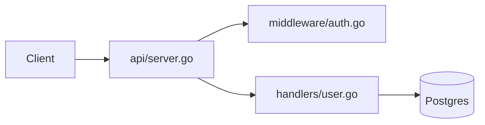

# Explaining Systems

**Explanations must be EVIDENCE-BACKED. Read the code first. Every structural claim cites a path and line.**

## Protocol

1. **Read before speaking.** Locate entry points, config files, service definitions. Do not describe from README alone - README is often stale.
2. **Trace one real request/data flow end-to-end.** Pick a representative operation (e.g., "create user POST /users"). Follow it through the actual code, not the idealized architecture.
3. **Cite everything structural.** Format: "`handler.go:42` calls `UserService.Create`". Never say "the handler calls the service" without the citation.
4. **Distinguish code-truth from inference.** Use explicit markers:
   - "The code does X (`path:line`)" - fact.
   - "This appears intended to Y (inference from naming/comments)" - inference.
5. **Surface surprises.** Things that differ from the name, README, or obvious expectation.

## Output Structure

```
### 30-Second Summary
<What this system does, for whom, in 3 sentences max.>

### Component Map
<What talks to what. One line per relationship. Citation per claim.>
[mermaid diagram if >= 4 components]

### Traced Flow: <operation name>
Step 1: <entry point> (`file:line`)
Step 2: ...

### Key Invariants and Conventions
- <rule the codebase enforces, with citation>

### Sharp Edges and Surprises
- <thing that will bite a newcomer, with citation>
```

## Mermaid Diagram (use when >= 4 components)



## Anti-Patterns

| Anti-Pattern | Symptom | Correction |
|---|---|---|
| README-only explanation | Claims not verifiable in code | Read the actual files; cite them |
| Invented layer names | "The orchestration layer..." | Only use names the code uses |
| Describing what SHOULD exist | "This would typically..." | Describe what IS; label inference |
| Skipping surprises | Explanation feels clean | Actively look for things that break the mental model |

## Rules

- MUST read the code before explaining it.
- MUST cite file:line for every structural claim.
- MUST trace at least one real request end-to-end.
- MUST verify claims against tests (tests are executable documentation).
- NEVER describe architecture from documentation alone.
